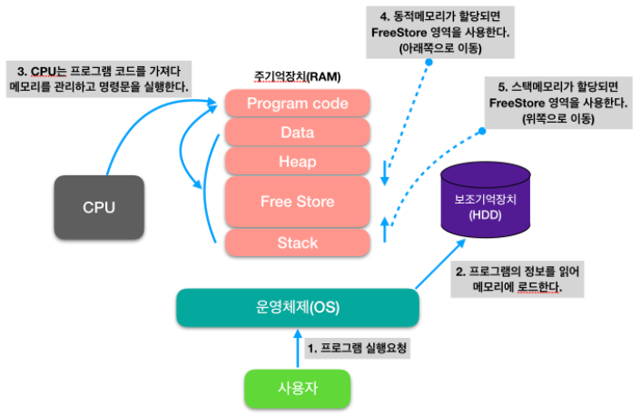

## 메모리 구조

### 메모리 종류

- 레지스터 (Register) : CPU 내 위치한 고속 메모리로 Bit 단위의 데이터를 저장함. FlipFlop으로 구성됨.
- 캐시 (Cache Memory) : CPU Core 바깥에 존재하여 주기억장치와 CPU 간 속도차를 극복하기 위해 사용. SRAM으로 구성됨.
- 주기억장치 (Main Memory) : CPU가 직접 접근하여 데이터를 사용. DRAM으로 구성.
- 보조기억장치 (Hard Disk Driver, Solid State Driver) : CPU가 직접 접근할 수 없고, Device Controller 등을 통해 접근이 가능. HDD는 자기디스크, SSD는 Flash Memory로 구성됨.
- 

### 메모리 계층 구조

- 저장(기억) 단위당 가격 <---> access 성능 간 trade off 존재
- 저장(기억) 용량 <---> 가격 간 trade off 존재
- access 성능 <---> 저장(기억) 용량 간 trade off 존재
- 속도 순 : 레지스터 > 캐시 > 주기억장치 > 보조기억장치
- 용량 지원 순 (단위당 저렴한 가격) 보조기억장치 > 주기억장치 > 캐시 > 레지스터

### 회로 구성

- 레지스터 플립플롭

- SRAM 플립플롭

- DRAM 캐패시터 1T1C

- Flash Memory 1T

### 프로그램 실행 순서

### 출처

> https://m.blog.naver.com/ya3344/221245662649
>
> https://jinshine.github.io/2018/05/17/%EC%BB%B4%ED%93%A8%ED%84%B0%20%EA%B8%B0%EC%B4%88/%EB%A9%94%EB%AA%A8%EB%A6%AC%EA%B5%AC%EC%A1%B0/